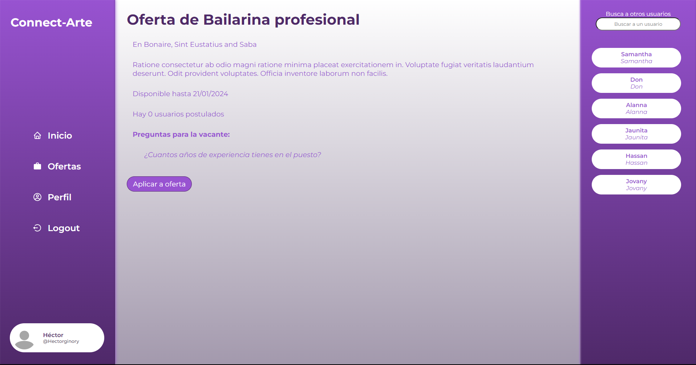

# Connect-arte #

**Autor:** Héctor Ginory

**Tecnologías:** ReactJS, HTML, CSS3, JavaScript - ES6, Git

<a href="https://connect-arte.vercel.app/">Haz click aquí para ver el deploy</a>
 
<a href="https://github.com/HectorGinory/Backend_Connect-Arte">Haz click aquí para ver el repositorio del backend</a>

## ¿Qué es Connect-arte? ##
Connect-arte nació debido a que en el mundo del arte, es muy complicado conseguir "x" empleos, debido a la falta de contactos que hay sobretodo al empezar.

Es por ello que decidí crear esta aplicación.

Connect-arte es una página de búsqueda de empleo para artistas. Obviamente ya existen páginas de búsquedas de empleo véase LinkedIn, Infojobs, ...

¿Pero porqué no hacer una enfocada directamente en conectar el arte?

Hasta ahora la página sólo consta de las siguientes secciones.

- Descubre/Home
- Registro
- Inicio de sesión
- Perfil de usuario:
    - Sección para modificar información general del usuario.
    - _Rol usuario_.- Sección para modificar añadir la educación del usuario.
    - _Rol usuario_.- Sección para modificar añadir la experiencia del usuario.
    - _Rol empresa_.- Sección para que el usuario pueda crear ofertas del trabajo.
- Búsqueda de empleo:
    - Sección para la búsqueda de empleo con sistema de paginación.
    -  _Rol usuario_.- Sección para aplicar en la oferta.
    - Sección para ver la cita en detalle.
        -  _Rol empresa_.- En caso de que la oferta sea suya, puede eliminarla y ver las respuestas de los usuarios.

### Vista _Home_ ###

Esta es la vista principal de página dónde hay un texto con una bienvenida, y justo bajo ella se puede encontrar una lista de ofertas de trabajo.

 - _Sin inicio de sesión_: Hace una búsqueda de ofertas de trabajo aleatorias, para que puedas ver qué ofertas hay en la app.

 - _Con inicio de sesión_: En caso de no haber modificado tu lista de _intereses_ en la sección de modificar el perfil, hará lo mismo que en caso de no tener sesión iniciada. En caso contrario, hará una búsqueda en las ofertas dónde aparezcan aquellas palabras que tienes en la lista de _intereses_

 

 ### Vista _Registro_ ###

 Esta es la clásica página de registro dónde tendrás que rellenar los siguientes campos:

    - Nombre: No puede tener más de 20 caracteres
    - Nombre de usuario: No puede contener espacios
    - Email: Debe ser un email válido
    - Contraseña: Debe contener 6 letras mínimo, mayusculas y ún numero.

Una vez introducidos los datos se hace una llamada a la API para registrar al usuario. Esta llamada devolverá un token que posteriormente vamos a guardarlo y decodificarlo en Redux con la siguiente estructura.

    {
        token: "cadenaDeTexto",
        user: {
            ...tokenDescoficado
        }
    }

 

 ### Vista _Inicio de sesión_ ###

  Esta es la clásica página de inicio de sesión dónde tendrás que rellenar los siguientes campos:

    - Email: Debe ser un email válido
    - Contraseña: Debe contener 6 letras mínimo, mayusculas y ún numero.

Una vez introducidos los datos se hace una llamada a la API para ver que los datos del usuario son correctos. Esta llamada devolverá un token que guardaremos en redux.

 

### Vista _Perfil usuario_ ###

 En esta vista podremos observar toda la información del usuario, para acceder a esta vista existen dos formas

    - /profile : Esto mostrará la vista del usuario que tenga la sesión iniciada
    - /user/:username : Esto mostrará la vista del usuario cuyo nombre de usuario sea igual a /:username

Dentro de esta vista tendremos varios componentes que se mostrarán o no en caso de tener la sesión iniciada del usuario que estemos viendo.

Si el usuario que estamos viendo NO es nuestro ususario con la sesión iniciada se mostrarán los siguientes componentes:

    - Botón para seguir/dejar de seguir al usuario

En caso de que la página sea la de nuestro usuario.

    - Botón para acceder a la vista para modificar el perfil.
    - Rol usuario: Botón para acceder a la vista para añadir educación.
    - Rol usuario: Botón para acceder a la vista para añadir experiencia.
    - Rol empresa: Botón para acceder a la vista para añadir oferta de empleo.

 

### Vista _Perfil usuario: modificar perfil_ ###

Dentro de esta vista podrás modificar mucha de la información de tu usuario, entre modificar la información que ya has introducido, hasta añadir campos nuevos entre ellos encontramos.

    - Nombre
    - Email
    - Nombre de usuario
    - Descripción
    - Ubicación
    - Rol (usuario/empresa)
    - Palabras claves (Para que encuentren tu perfil según los intereses de otros usuarios)
    - Palabras de interés (Para que encuentren usuarios según los intereses de tu perfil)

Esto enviará a la API dicha información junto al nombre del usuario dónde es modificará dicha información.

 

#### Vista _Perfil usuario: añadir educación_ ####

En esta vista habrá un formulario que tendrás que rellenar con todos los campos para poder añadir dicha información.

    - Escuela
    - Título
    - Disciplina
    - Fecha de Inicio
    - Fecha de fin
    - Descripción

Esto enviará a la API dicha información junto al nombre del usuario dónde es indexara dicha información.

  

#### Vista _Perfil usuario: añadir experiencia_ ####

En esta vista habrá un formulario que tendrás que rellenar con todos los campos para poder añadir dicha información.

    - Nombre del cargo
    - Empresa
    - Ubicación
    - Fecha de Inicio
    - Fecha de fin
    - Descripción

Esto enviará a la API dicha información junto al nombre del usuario dónde es indexara dicha información.

  

#### Vista _Perfil usuario: añadir oferta_ ####

En esta vista habrá un formulario que tendrás que rellenar con todos los campos para poder añadir dicha información.

    - Nombre del cargo
    - Sector
    - Ubicación
    - Fecha límite para aplicar
    - Descripción

Además de un máximo de hasta 3 preguntas opcionales, para que los usuarios que quieran aplicar respondan. 

Esto enviará a la API dicha información junto al nombre del usuario dónde es indexara dicha información.

  

#### Vista _Búsqueda de empleo_ ####

En esta vista te aparecerán una lista de ofertas de empleo que tu podrás filtrar rellenando el input que aparece arriba.

Este al modificarse mandará el criterio para que busque en esas ofertas el texto por el que estás buscando.

Al hacer click en cualquiera de las ofertas aparecerá en la parte inferior una pequeña muestra de la información de la oferta, dandote dos opciones.

    - Ver oferta en detalle
    - Aplicar a la oferta

Además detecta si el usuario registrado es empresa, y en caso de serlo aparecerá un botón dónde puedes ir directamente a la sección explicada antes para crear una oferta de empleo.

  

#### Vista _Oferta en detalle_ ####

En esta vista se usará los path params para hacer una búsqueda de la oferta en cuestión. Dentro de esta se mostrará toda la información de dicha cita, añadiendo la opción en caso de ser usuario de aplicar a dicha cita.

O en caso de ser el que creó la cita la opción de eliminarla y de ver las respuestas de la gente que ha aplicado a la misma.

  

#### Vista _Aplicar a oferta_ ####

En esta vista se buscará la información de la cita en cuestión y se mostrará en pantalla las preguntas que tenga la vacante, en caso de tenerlas, y un area de texto para que puedas hacer una pequeña presentación en caso de que el usuario lo vea conveniente.

  

### Futuras implementaciones ###

- Añadir foto de perfil y de banner al usuario
- Poder hacer publicaciones, para hablar de proyectos, ...
- Añadir mensajería entre usuarios
- Añadir notificaciones (gente que te ha seguido, interacciones, ...)